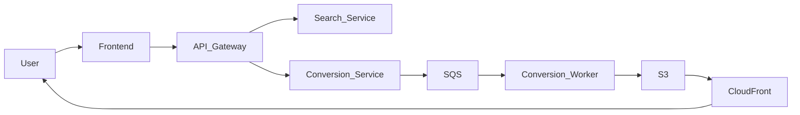
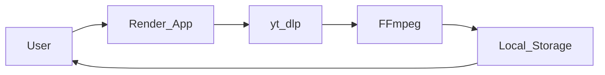

Skip to main content
Google Classroom
Classroom
CS331-CS32-2026
Cs32
Assignment 5
Assignment 5

# CS 331 -- Assignment 5

# Hosting and Deployment Guide -- Sun Leo (YouTube to MP3 System)

---

# APPROACH 1: Deployment Using AWS (If Free Credits Are Available)

## I. Hosting Plan for Application Components

### 1. Host Site

---

Component AWS Service Purpose

---

API Gateway AWS EC2 + Nginx Public entry point

Frontend (Streamlit) EC2 Instance UI hosting

Search Service ECS / EC2 YouTube search
handling

Conversion Service ECS with Auto Scaling CPU-heavy MP3
conversion

Storage Service EC2 Link generation &
management

Job Queue Amazon SQS Asynchronous task
handling

File Storage Amazon S3 Store converted MP3
files

CDN CloudFront Fast download
delivery

Database (optional) RDS / DynamoDB User & playlist data

---

---

### 2. Deployment Strategy

#### Step 1 -- Containerization

- Package each service using Docker
- Push Docker images to Amazon ECR

#### Step 2 -- Infrastructure Setup

- Create VPC
- Public subnet → API Gateway & Frontend
- Private subnet → Search, Conversion, Storage
- Configure Security Groups

#### Step 3 -- Service Deployment

- Deploy services on ECS or EC2
- Configure environment variables:
  - SEARCH_SERVICE_URL
  - CONVERSION_SERVICE_URL
  - STORAGE_SERVICE_URL

#### Step 4 -- Queue Configuration

- Configure SQS
- Conversion workers poll queue for jobs

#### Step 5 -- Storage & Delivery

- Store MP3 files in S3
- Generate signed URLs
- Deliver via CloudFront

---

### 3. Security Measures

- HTTPS using AWS Certificate Manager
- IAM roles for service-level access control
- S3 bucket encryption
- Firewall rules using Security Groups
- Signed URLs for file downloads
- Rate limiting at API Gateway

---

## II. End User Access -- AWS Deployment

### User Interaction Flow

1.  User opens frontend URL
2.  Sends request to API Gateway
3.  Gateway routes to Search / Conversion
4.  Conversion Service processes job
5.  File stored in S3
6.  Download link generated
7.  User downloads MP3

---

### System Interaction Diagram (AWS)

---

# APPROACH 2: Deployment Using Render.com (Completely Free)

## I. Hosting Plan for Application Components

### 1. Host Site

Component Hosting Platform Notes

---

Monolithic Streamlit App Render Web Service Free tier
Conversion Logic Same service (initially) Can split later
Search Logic Same service Currently monolith
File Storage Local temporary storage Reset on restart
Optional Storage Upgrade Cloudinary / Supabase Free tier
Queue (Optional) Render Background Worker Free tier supported

---

### 2. Deployment Strategy

#### Step 1 -- Push Code to GitHub

- Upload project files
- Add requirements.txt
- Add Procfile

Example Procfile:

    web: streamlit run home.py --server.port $PORT --server.address 0.0.0.0

#### Step 2 -- Create Render Web Service

- Connect GitHub repo
- Select Python environment
- Choose Free Plan

#### Step 3 -- Install FFmpeg During Build

Build Command:

    apt-get update && apt-get install -y ffmpeg

#### Step 4 -- Environment Variables

- Add any API keys in Render dashboard

#### Step 5 -- Deployment

- Render auto-builds and deploys
- Public URL provided

---

### 3. Security Measures

- HTTPS automatically enabled by Render
- Environment variables for secret keys
- Input validation in Streamlit app
- Rate limiting (optional via middleware)
- Restrict file size uploads

---

## II. End User Access -- Render Deployment

### User Interaction Flow

1.  User opens Render public URL
2.  Streamlit frontend loads
3.  User submits YouTube link
4.  yt-dlp downloads and converts
5.  File offered as download
6.  Optional: upload to cloud storage

---

### System Interaction Diagram (Render)

---

# Comparison Summary

Feature AWS Deployment Render Deployment

---

Cost Free with credits Completely free
Scalability High Limited
Microservices Ready Yes Partial
Infrastructure Control Full Limited
Setup Complexity High Low
Suitable for College Project Optional Highly Recommended

---

