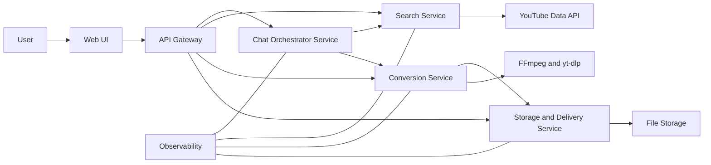

# Overall Microservices Architecture

```mermaid
flowchart LR
    U[User] --> UI[Web UI]
    UI --> APIGW[API Gateway]

    APIGW --> CHAT[Chat Orchestrator Service]
    APIGW --> SEARCH[Search Service]
    APIGW --> CONV[Conversion Service]
    APIGW --> STORE[Storage and Delivery Service]

    CHAT --> SEARCH
    CHAT --> CONV
    CONV --> STORE

    SEARCH --> YT[YouTube Data API]
    CONV --> FF[FFmpeg and yt-dlp]
    STORE --> FS[File Storage]

    LOG[Observability] --- CHAT
    LOG --- SEARCH
    LOG --- CONV
    LOG --- STORE
```
