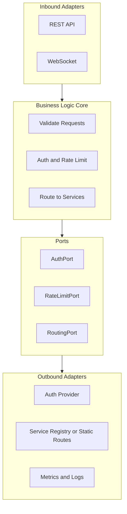

# API Gateway Service (Hexagonal)

```mermaid
flowchart TB
    subgraph Inbound[Inbound Adapters]
        HTTP[REST API]
        WS[WebSocket]
    end

    subgraph Core[Business Logic Core]
        UC1[Validate Requests]
        UC2[Auth and Rate Limit]
        UC3[Route to Services]
    end

    subgraph Ports[Ports]
        P1[AuthPort]
        P2[RateLimitPort]
        P3[RoutingPort]
    end

    subgraph Outbound[Outbound Adapters]
        IDP[Auth Provider]
        SRV[Service Registry or Static Routes]
        MET[Metrics and Logs]
    end

    Inbound --> Core
    Core --> Ports
    Ports --> Outbound
```
