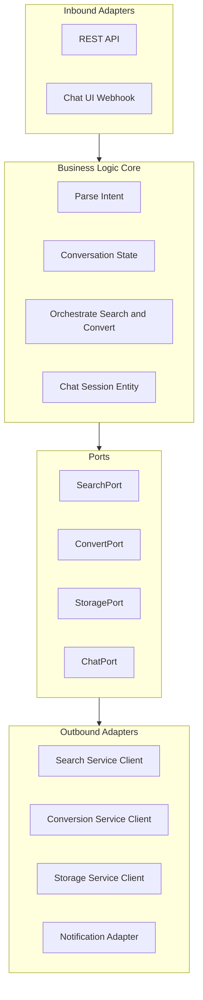

# Chat Orchestrator Service (Hexagonal)

```mermaid
flowchart TB
    subgraph Inbound[Inbound Adapters]
        HTTP[REST API]
        UI[Chat UI Webhook]
    end

    subgraph Core[Business Logic Core]
        UC1[Parse Intent]
        UC2[Conversation State]
        UC3[Orchestrate Search and Convert]
        ENT[Chat Session Entity]
    end

    subgraph Ports[Ports]
        P1[SearchPort]
        P2[ConvertPort]
        P3[StoragePort]
        P4[ChatPort]
    end

    subgraph Outbound[Outbound Adapters]
        SEARCH[Search Service Client]
        CONV[Conversion Service Client]
        STORE[Storage Service Client]
        NTFY[Notification Adapter]
    end

    Inbound --> Core
    Core --> Ports
    Ports --> Outbound
```
