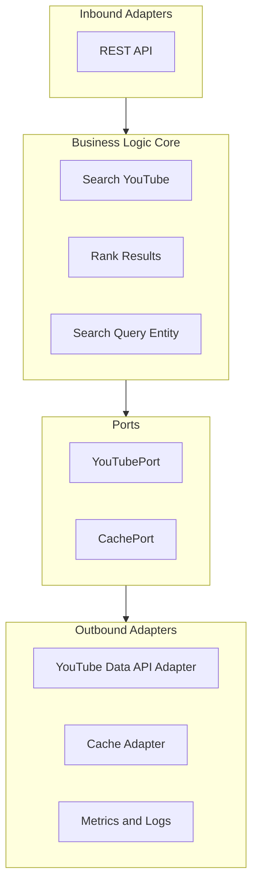

# Search Service (Hexagonal)

```mermaid
flowchart TB
    subgraph Inbound[Inbound Adapters]
        HTTP[REST API]
    end

    subgraph Core[Business Logic Core]
        UC1[Search YouTube]
        UC2[Rank Results]
        ENT[Search Query Entity]
    end

    subgraph Ports[Ports]
        P1[YouTubePort]
        P2[CachePort]
    end

    subgraph Outbound[Outbound Adapters]
        YT[YouTube Data API Adapter]
        CACHE[Cache Adapter]
        MET[Metrics and Logs]
    end

    Inbound --> Core
    Core --> Ports
    Ports --> Outbound
```
