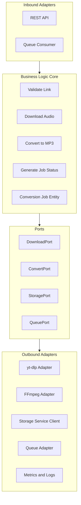

# Conversion Service (Hexagonal)

```mermaid
flowchart TB
    subgraph Inbound[Inbound Adapters]
        HTTP[REST API]
        QIN[Queue Consumer]
    end

    subgraph Core[Business Logic Core]
        UC1[Validate Link]
        UC2[Download Audio]
        UC3[Convert to MP3]
        UC4[Generate Job Status]
        ENT[Conversion Job Entity]
    end

    subgraph Ports[Ports]
        P1[DownloadPort]
        P2[ConvertPort]
        P3[StoragePort]
        P4[QueuePort]
    end

    subgraph Outbound[Outbound Adapters]
        DL[yt-dlp Adapter]
        FF[FFmpeg Adapter]
        STORE[Storage Service Client]
        QOUT[Queue Adapter]
        MET[Metrics and Logs]
    end

    Inbound --> Core
    Core --> Ports
    Ports --> Outbound
```
