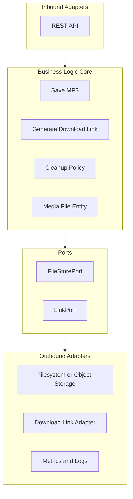

# Storage and Delivery Service (Hexagonal)

```mermaid
flowchart TB
    subgraph Inbound[Inbound Adapters]
        HTTP[REST API]
    end

    subgraph Core[Business Logic Core]
        UC1[Save MP3]
        UC2[Generate Download Link]
        UC3[Cleanup Policy]
        ENT[Media File Entity]
    end

    subgraph Ports[Ports]
        P1[FileStorePort]
        P2[LinkPort]
    end

    subgraph Outbound[Outbound Adapters]
        FS[Filesystem or Object Storage]
        CDN[Download Link Adapter]
        MET[Metrics and Logs]
    end

    Inbound --> Core
    Core --> Ports
    Ports --> Outbound
```
