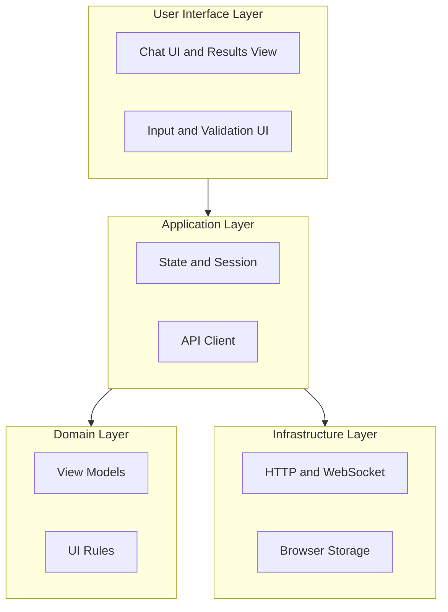

# Frontend Web UI (Layered)

```mermaid
flowchart TB
    subgraph UI[User Interface Layer]
        VIEW[Chat UI and Results View]
        FORM[Input and Validation UI]
    end

    subgraph APP[Application Layer]
        STATE[State and Session]
        CLIENT[API Client]
    end

    subgraph DOMAIN[Domain Layer]
        MODEL[View Models]
        RULES[UI Rules]
    end

    subgraph INFRA[Infrastructure Layer]
        HTTP[HTTP and WebSocket]
        CACHE[Browser Storage]
    end

    UI --> APP
    APP --> DOMAIN
    APP --> INFRA
```
