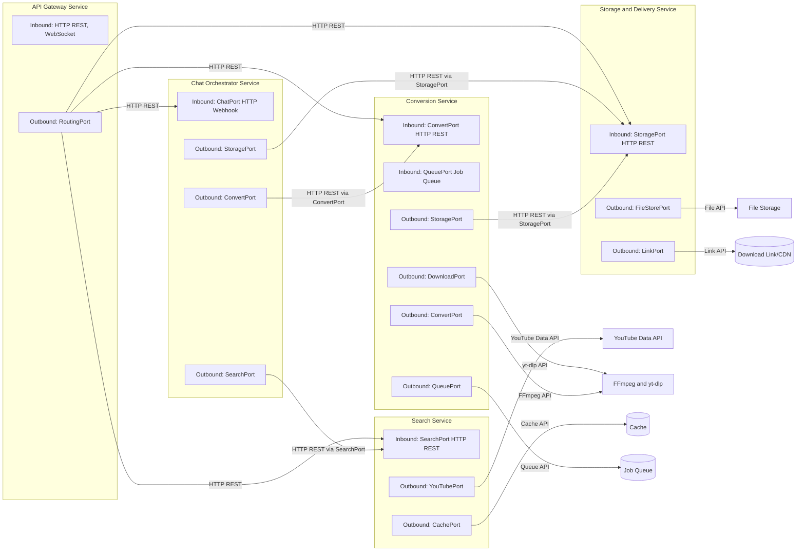

# Services, Ports, and Interactions Overview

```mermaid
flowchart LR
    %% Services as boxes
    subgraph APIGW[API Gateway Service]
        APIGW_IN[Inbound: HTTP REST, WebSocket]
        APIGW_OUT[Outbound: RoutingPort]
    end

    subgraph CHAT[Chat Orchestrator Service]
        CHAT_IN[Inbound: ChatPort HTTP Webhook]
        CHAT_OUT1[Outbound: SearchPort]
        CHAT_OUT2[Outbound: ConvertPort]
        CHAT_OUT3[Outbound: StoragePort]
    end

    subgraph SEARCH[Search Service]
        SEARCH_IN[Inbound: SearchPort HTTP REST]
        SEARCH_OUT1[Outbound: YouTubePort]
        SEARCH_OUT2[Outbound: CachePort]
    end

    subgraph CONV[Conversion Service]
        CONV_IN1[Inbound: ConvertPort HTTP REST]
        CONV_IN2[Inbound: QueuePort Job Queue]
        CONV_OUT1[Outbound: DownloadPort]
        CONV_OUT2[Outbound: ConvertPort]
        CONV_OUT3[Outbound: StoragePort]
        CONV_OUT4[Outbound: QueuePort]
    end

    subgraph STORE[Storage and Delivery Service]
        STORE_IN[Inbound: StoragePort HTTP REST]
        STORE_OUT1[Outbound: FileStorePort]
        STORE_OUT2[Outbound: LinkPort]
    end

    %% External systems
    YT[YouTube Data API]
    FF[FFmpeg and yt-dlp]
    FS[File Storage]

    %% Interactions with ports and APIs
    APIGW_OUT -->|HTTP REST| CHAT_IN
    APIGW_OUT -->|HTTP REST| SEARCH_IN
    APIGW_OUT -->|HTTP REST| CONV_IN1
    APIGW_OUT -->|HTTP REST| STORE_IN

    CHAT_OUT1 -->|HTTP REST via SearchPort| SEARCH_IN
    CHAT_OUT2 -->|HTTP REST via ConvertPort| CONV_IN1
    CHAT_OUT3 -->|HTTP REST via StoragePort| STORE_IN

    SEARCH_OUT1 -->|YouTube Data API| YT
    SEARCH_OUT2 -->|Cache API| CACHE[(Cache)]

    CONV_OUT1 -->|yt-dlp API| FF
    CONV_OUT2 -->|FFmpeg API| FF
    CONV_OUT3 -->|HTTP REST via StoragePort| STORE_IN
    CONV_OUT4 -->|Queue API| QUEUE[(Job Queue)]

    STORE_OUT1 -->|File API| FS
    STORE_OUT2 -->|Link API| CDN[(Download Link/CDN)]
```
