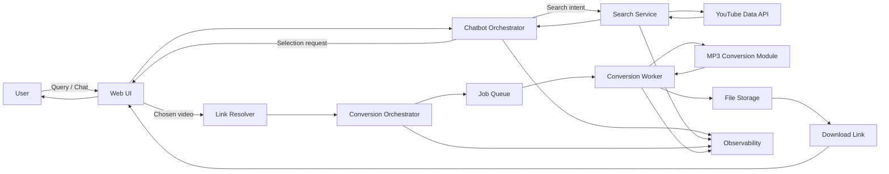

# End-to-End Flow

```mermaid
flowchart LR
    U[User] -->|Query / Chat| UI[Web UI]
    UI --> BOT[Chatbot Orchestrator]
    BOT -->|Search intent| SRCH[Search Service]
    SRCH --> YT[YouTube Data API]
    YT --> SRCH
    SRCH --> BOT
    BOT -->|Selection request| UI
    UI -->|Chosen video| RES[Link Resolver]
    RES --> ORCH[Conversion Orchestrator]
    ORCH --> Q[Job Queue]
    Q --> WORK[Conversion Worker]
    WORK --> MOD[MP3 Conversion Module]
    MOD --> WORK
    WORK --> STORE[File Storage]
    STORE --> DL[Download Link]
    DL --> UI
    UI --> U

    BOT --> LOG[Observability]
    SRCH --> LOG
    ORCH --> LOG
    WORK --> LOG
```
