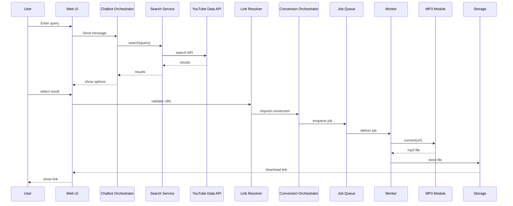

# Sequence: Chat → Search → Convert

```mermaid
sequenceDiagram
    participant U as User
    participant UI as Web UI
    participant BOT as Chatbot Orchestrator
    participant SR as Search Service
    participant YT as YouTube Data API
    participant RES as Link Resolver
    participant OR as Conversion Orchestrator
    participant Q as Job Queue
    participant W as Worker
    participant MOD as MP3 Module
    participant ST as Storage

    U->>UI: Enter query
    UI->>BOT: Send message
    BOT->>SR: search(query)
    SR->>YT: search API
    YT-->>SR: results
    SR-->>BOT: results
    BOT-->>UI: show options
    U->>UI: select result
    UI->>RES: validate URL
    RES->>OR: request conversion
    OR->>Q: enqueue job
    Q->>W: deliver job
    W->>MOD: convert(url)
    MOD-->>W: mp3 file
    W->>ST: store file
    ST-->>UI: download link
    UI-->>U: show link
```
