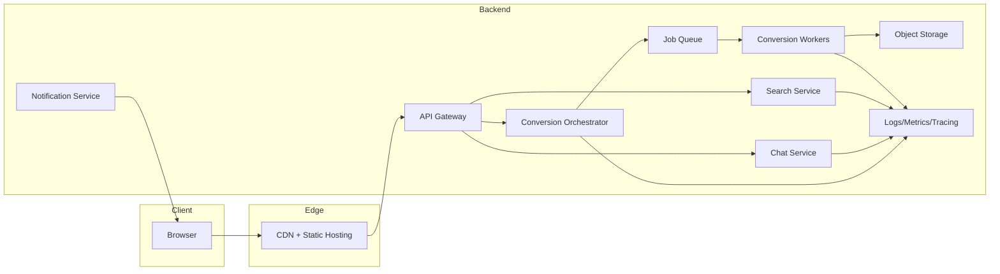

# Deployment View

```mermaid
flowchart LR
    subgraph Client
        C1[Browser]
    end

    subgraph Edge
        CDN[CDN + Static Hosting]
    end

    subgraph Backend
        APIGW[API Gateway]
        CHAT[Chat Service]
        SEARCH[Search Service]
        CONV[Conversion Orchestrator]
        QUEUE[Job Queue]
        WORK[Conversion Workers]
        STORE[Object Storage]
        NOTIF[Notification Service]
        OBS[Logs/Metrics/Tracing]
    end

    C1 --> CDN --> APIGW
    APIGW --> CHAT
    APIGW --> SEARCH
    APIGW --> CONV
    CONV --> QUEUE --> WORK --> STORE
    WORK --> OBS
    SEARCH --> OBS
    CHAT --> OBS
    CONV --> OBS
    NOTIF --> C1
```
