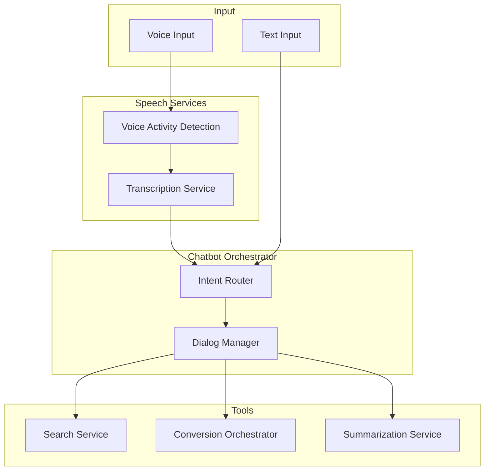

# Future Extensions (Voice to Text & More)

```mermaid
flowchart TB
    subgraph Input
        V[Voice Input]
        T[Text Input]
    end

    subgraph Speech[Speech Services]
        ASR[Transcription Service]
        VAD[Voice Activity Detection]
    end

    subgraph Core[Chatbot Orchestrator]
        IR[Intent Router]
        DM[Dialog Manager]
    end

    subgraph Tools
        SRCH[Search Service]
        CONV[Conversion Orchestrator]
        SUM[Summarization Service]
    end

    V --> VAD --> ASR --> IR
    T --> IR
    IR --> DM
    DM --> SRCH
    DM --> CONV
    DM --> SUM
```
