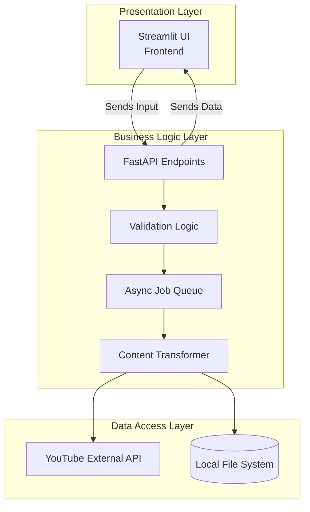
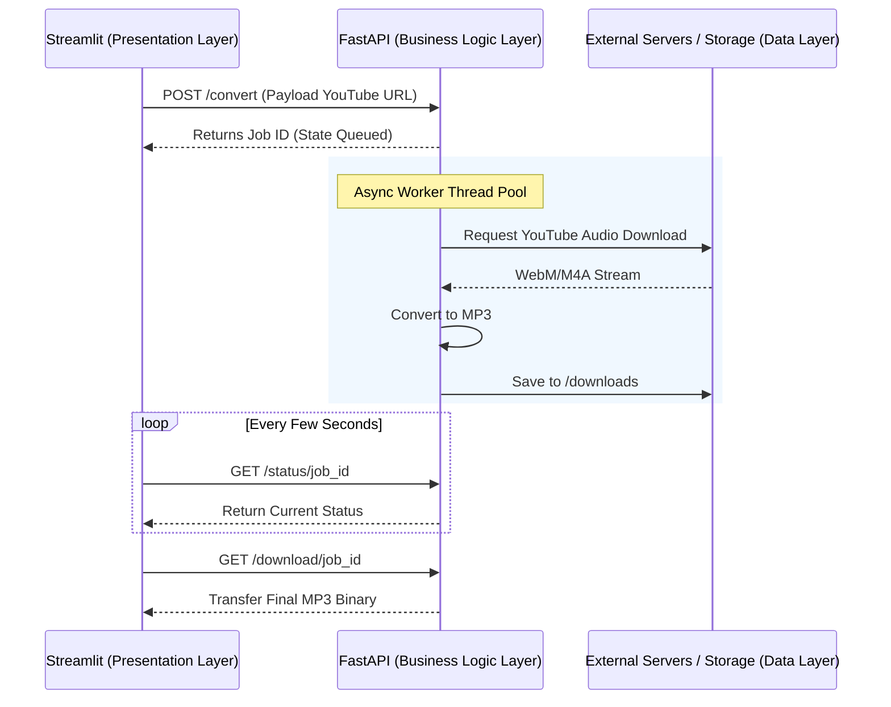

# Business Logic Layer - SunLeo Application (Assignment 7)

## Theory: The Three-Tier Architecture
In modern software engineering, applications are often divided into distinct layers to separate concerns, improve maintainability, and enhance scalability. The most common pattern is the **Three-Tier Architecture**, which consists of the following layers:

1. **Presentation Layer (User Interface)**: The topmost level of the application. It is responsible for translating tasks and results to something the user can interact with and understand. In SunLeo, this is implemented using **Streamlit**, which renders the web pages, handles Google OAuth login, and collects user inputs (e.g., YouTube URLs).
2. **Business Logic Layer (BLL)**: Also known as the domain or application layer. This layer represents the core of the application where all the critical rules, data processing, validation, and complex asynchronous workflows occur. It mediates between the Presentation layer and the Data Access layer. In SunLeo, this is the **FastAPI backend** (including the YT Converter and Recommendation Service).
3. **Data Access Layer (Data / Infrastructure)**: The layer responsible for interacting with databases, file systems, or external APIs to persist and retrieve data. In SunLeo, this includes saving MP3s to the local `downloads/` directory, querying YouTube servers using `yt-dlp`, and reading/writing temporary state.

**Distinction:** The Presentation layer only cares about *how* to show data, the Data Access layer only cares about *how* to store and fetch data, whereas the Business Logic Layer cares about *what* happens to that data (the "why" and "when"), enforcing constraints, transforming raw data, and verifying requests before they proceed.

---

## Q1. Identify the core functional modules related to the business logic layer of your software. Implement them and clearly show their interaction with the components of the presentation layer.

The core functional modules of the Business Logic Layer in the SunLeo application are built primarily within the FastAPI backend architecture. The major modules identified are:

1. **YT Converter Module (`ytconverter/app`)**:
   - **Job Queueing & Processing (`queue.py`, `main.py`)**: Manages concurrent asynchronous conversion tasks (up to 3 concurrent downloads) taking user requests from the queue and converting YouTube audio streams into `.mp3` format. 
   - **Background Cleanup (`main.py`)**: Runs independently as a background task to periodically check for and delete downloaded MP3 files older than 1 hour to optimize server storage, and frees up in-memory job dictionaries.
   - **Audio Extract & Convert (`converter.py`)**: Wraps `yt-dlp` to download best-quality audio and uses `ffmpeg` for consistent post-processing to 192kbps MP3s.

2. **Recommendation Service (`recommendation_service/app`)**: 
   - **Constraint Enforcement (`main.py`)**: Processes structured queries for song recommendations while explicitly enforcing specific attribute limits (e.g., maximum constraints on seed genres and output limit thresholds) to keep the recommendation algorithms focused.

**Interaction with the Presentation Layer (Streamlit Frontend):**
- The **Streamlit UI** handles all user inputs natively and invokes HTTP REST API calls to the **FastAPI BLL** endpoints (e.g., `/convert` or `/convert/batch`).
- The frontend continuously polls the BLL's `/status/{job_id}` endpoint to communicate the async job execution states (queued, running, completed, failed). This allows the UI to render real-time progress bars. Upon completion, the UI sequentially fetches the final transformed media from the `/download/{job_id}` handler.

---

## Q2. Describe the following for your software engineering project.

### A) Implementation of Business Rules
Business rules in SunLeo are embedded natively inside the backend modules:
- **Batch Processing Limits**: Within the `ytconverter/app/main.py` route `/convert/batch`, a business rule restricts users to converting a maximum of 10 URLs in a single batch to prevent server overload (`if len(request.urls) > 10: raise HTTPException(...)`).
- **Resource Cleanup Rule**: A core infrastructure business rule dictates that temporary media files must not drain disk space permanently. Thus, `_cleanup_old_files_task` deletes any mp3 downloads and job tracking records that are older than 3600 seconds (1 hour) every 10 minutes.
- **Conversion Quality Constraints**: Conversion explicitly dictates dropping default youtube video formats and standardizing onto 192kbps MP3 (`"preferredcodec": "mp3", "preferredquality": "192"`), enforcing uniform audio experiences across the board.

### B) Validation Logic
Extensive validation is implemented using **Pydantic Models** and manual assertions before processing:
- **URL Syntax Validation**: In `ytconverter/app/utils.py`, `validate_youtube_url()` ensures incoming URLs have an `http` or `https` scheme, fall under valid netlocs (`youtube.com`, `youtu.be`), and possess a correctly extracting video ID pattern before passing them to the queue.
- **Payload Validation**: `ConvertRequest` and `RecommendationRequest` use Pydantic models to strictly enforce data types. For instance, the recommendation module uses `Field(..., max_items=5)` to validate that exactly 5 or fewer genres are provided in a single API call. 
- **State Validation**: Before any file download proceeds (`/download/{job_id}`), the system validates whether the explicit job's status evaluates to `JobStatus.completed`; if the file isn't fundamentally ready or the job doesn't exist, it formally rejects the presentation layer request.

### C) Data Transformation
Data coming from the external data layer (YouTube metadata) and system configurations is dynamically transformed for UI usage:
- **Metadata Extraction & Reformatting**: The raw, verbose metadata retrieved via `yt-dlp` inside `converter.py` is parsed and transformed into a concise, standard dictionary (`{"title": ..., "uploader": ..., "duration": ..., "thumbnail": ...}`). This smaller footprint data is exactly what the presentation layer requires to render Track Info Cards seamlessly.
- **Format Transformation**: The actual video/audio file buffer received from YouTube servers is programmatically transformed from arbitrary formats (like `.webm` or `.m4a`) into a standardized `.mp3` via FFmpeg metadata extraction bindings prior to presentation to the user.
- **Internal Model to JSON Delivery**: Internal python state structures (like `JobRecord` dataclasses) are consistently transformed to strictly patterned `StatusResponse` and `ConvertResponse` JSON shapes, ensuring the frontend always receives predictable payload structures regardless of the backend implementation details.
