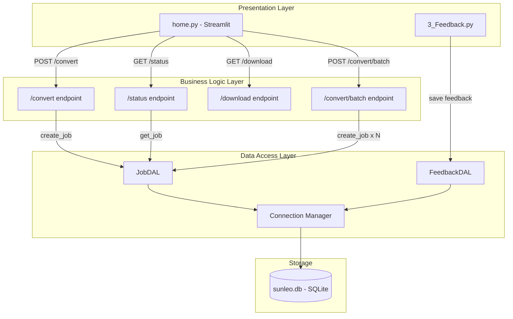

# Data Access Layer — SunLeo Implementation Walkthrough

## Overview

This document provides a detailed walkthrough of the Data Access Layer (DAL) implemented for the SunLeo application as part of Assignment 8. It explains the database schema, every component of the DAL code, and how the DAL integrates with the existing application architecture.

---

## 1. Database Schema Design

The SunLeo DAL uses **SQLite** — a lightweight, serverless, file-based database engine. It requires zero configuration and is ideal for applications of this scale.

The schema is defined in [`schema.sql`](file:///c:/Users/shour/Desktop/SunLeo/backend/database/schema.sql) and contains two tables:

### 1.1 `jobs` Table

| Column | Type | Constraints | Purpose |
|--------|------|------------|---------|
| `job_id` | TEXT | PRIMARY KEY | UUID hex string, uniquely identifies each conversion job |
| `url` | TEXT | NOT NULL | Original YouTube URL submitted by the user |
| `video_id` | TEXT | NOT NULL | Extracted YouTube video ID (e.g., `dQw4w9WgXcQ`) |
| `status` | TEXT | NOT NULL, DEFAULT 'queued' | Current state: `queued`, `running`, `completed`, `failed` |
| `title` | TEXT | — | Video title (populated after successful download) |
| `file_path` | TEXT | — | Absolute path to the converted MP3 file |
| `error` | TEXT | — | Error message if the job failed |
| `metadata` | TEXT | — | JSON blob containing video metadata (uploader, duration, etc.) |
| `created_at` | TEXT | NOT NULL, DEFAULT now | ISO 8601 timestamp of when the job was created |
| `started_at` | TEXT | — | When processing began |
| `finished_at` | TEXT | — | When processing completed or failed |

**Indexes:**
- `idx_jobs_finished_at` — Speeds up the cleanup query that deletes old jobs
- `idx_jobs_status` — Speeds up status-based filtering

### 1.2 `feedback` Table

| Column | Type | Constraints | Purpose |
|--------|------|------------|---------|
| `id` | INTEGER | PRIMARY KEY AUTOINCREMENT | Auto-generated unique ID |
| `name` | TEXT | NOT NULL | Submitter's name |
| `email` | TEXT | NOT NULL | Submitter's email |
| `category` | TEXT | NOT NULL | Bug Report / Feature Request / General Feedback / Other |
| `message` | TEXT | NOT NULL | The feedback content |
| `timestamp` | TEXT | NOT NULL, DEFAULT now | When the feedback was submitted |

**Indexes:**
- `idx_feedback_category` — Speeds up category-based filtering

---

## 2. Component Walkthrough

### 2.1 Connection Manager — [`connection.py`](file:///c:/Users/shour/Desktop/SunLeo/backend/database/connection.py)

The connection manager provides two functions:

**`init_db(db_path)`** — Called once at application startup. Reads `schema.sql` and executes it to create all tables (using `CREATE TABLE IF NOT EXISTS` for idempotency).

**`get_db(db_path)`** — Async context manager used in every DAL operation. Opens a connection, sets the row factory to `aiosqlite.Row` (enabling dict-like column access), and automatically closes the connection when done.

```python
# Usage in application code
async with get_db() as db:
    dal = JobDAL(db)
    job = await dal.get_job("abc123")
```

> **Why aiosqlite?** FastAPI is an async framework. Using synchronous `sqlite3` would block the event loop during database calls. `aiosqlite` wraps SQLite in a background thread, providing an async-compatible interface.

### 2.2 Data Transfer Objects — [`models.py`](file:///c:/Users/shour/Desktop/SunLeo/backend/database/models.py)

Two `@dataclass` classes serve as typed containers for database rows:

- **`JobRow`** — Maps to the `jobs` table. Contains a `from_row()` class method that:
  - Converts an `aiosqlite.Row` into a Python dataclass
  - Deserializes the JSON `metadata` column back into a Python `dict`

- **`FeedbackRow`** — Maps to the `feedback` table with a similar `from_row()` factory.

These DTOs ensure the rest of the application never works with raw SQL rows directly — providing type safety and a clean API boundary.

### 2.3 Repository Classes — [`dal.py`](file:///c:/Users/shour/Desktop/SunLeo/backend/database/dal.py)

This is the core of the DAL. It contains two repository classes:

#### `JobDAL` — Conversion Job Operations

| Method | SQL Operation | Description |
|--------|--------------|-------------|
| `create_job(job_id, url, video_id)` | `INSERT` | Creates a new job with status 'queued' |
| `get_job(job_id)` | `SELECT` | Retrieves a single job by ID, returns `None` if not found |
| `update_job_status(job_id, status, **kwargs)` | `UPDATE` | Dynamically updates status and any optional fields |
| `list_jobs(limit)` | `SELECT` | Returns recent jobs ordered by creation time |
| `delete_old_jobs(age_seconds)` | `DELETE` | Removes jobs older than the specified age |

**Key design decision:** `update_job_status()` dynamically builds its SQL `SET` clause based on which keyword arguments are provided. This avoids overwriting fields with `NULL` when only updating the status.

#### `FeedbackDAL` — User Feedback Operations

| Method | SQL Operation | Description |
|--------|--------------|-------------|
| `save_feedback(name, email, category, message)` | `INSERT` | Stores feedback, returns auto-generated ID |
| `get_all_feedback()` | `SELECT` | Returns all feedback, newest first |
| `get_feedback_by_category(category)` | `SELECT` | Filters feedback by category |

---

## 3. Before & After Comparison

### Job Tracking

**Before (in-memory dict):**
```python
# main.py — data lost on restart!
jobs: Dict[str, JobRecord] = {}
jobs[job_id] = JobRecord(job_id=job_id, url=url, video_id=video_id)
```

**After (DAL + SQLite):**
```python
# Using the DAL — data persists across restarts
async with get_db() as db:
    dal = JobDAL(db)
    await dal.create_job(job_id, url, video_id)
    job = await dal.get_job(job_id)  # survives server restart
```

### Feedback Storage

**Before (flat JSON file):**
```python
# 3_Feedback.py — no querying, no filtering 
with open(FEEDBACK_FILE, "w") as f:
    json.dump(existing, f, indent=2)
```

**After (DAL + SQLite):**
```python
# Using the DAL — structured, queryable
async with get_db() as db:
    dal = FeedbackDAL(db)
    fb_id = await dal.save_feedback("John", "john@email.com", "Bug Report", "...")
    bugs = await dal.get_feedback_by_category("Bug Report")  # easy filtering!
```

---

## 4. Architecture Diagram (After DAL Integration)



---

## 5. File Structure

```
backend/database/
├── __init__.py       # Package exports
├── connection.py     # Async connection manager (init_db, get_db)
├── models.py         # JobRow, FeedbackRow dataclasses (DTOs)
├── dal.py            # JobDAL, FeedbackDAL repository classes
├── schema.sql        # DDL for creating tables and indexes
└── sunleo.db         # SQLite database file (created at runtime)
```
