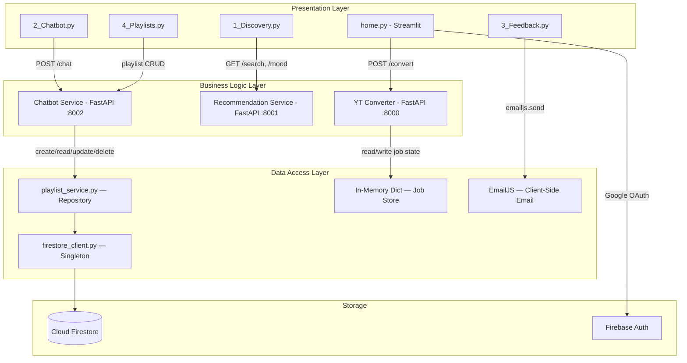

# Data Access Layer — SunLeo Implementation Walkthrough

## Overview

This document provides a detailed walkthrough of the Data Access Layer (DAL) implemented for the SunLeo application. It explains the database schema (Firestore document structure), every component of the DAL code, and how the DAL integrates with the existing application architecture.

SunLeo uses **Firebase Cloud Firestore** — a serverless, NoSQL, document-based database hosted by Google — as its primary persistent data store for user-specific data (playlists). Firebase Authentication handles user identity, and EmailJS handles feedback delivery.

---

## 1. Database Schema Design (Firestore Document Structure)

Unlike traditional SQL databases that use tables, rows, and columns, Firestore organizes data into **collections** and **documents**. Each document is a JSON-like map of key-value pairs, and documents can contain nested **subcollections**.

### 1.1 Overall Firestore Hierarchy

```
firestore-root/
└── users/                              ← Top-level collection
    └── {uid}/                          ← Document (keyed by Firebase Auth UID)
        └── playlists/                  ← Subcollection
            └── {playlist_id}/          ← Document (UUID)
                ├── name: string
                ├── tracks: array<TrackMap>
                ├── track_count: number
                ├── created_at: timestamp
                └── updated_at: timestamp
```

### 1.2 `users/{uid}/playlists/{playlist_id}` Document

| Field | Type | Description |
|-------|------|-------------|
| `name` | `string` | User-defined name for the playlist (e.g., "Workout Mix") |
| `tracks` | `array<TrackMap>` | Ordered list of track objects |
| `track_count` | `number` | Cached count of tracks (denormalized for fast display) |
| `created_at` | `timestamp` | UTC timestamp of when the playlist was created |
| `updated_at` | `timestamp` | UTC timestamp of the last modification |

### 1.3 `TrackMap` Object (inside `tracks` array)

| Field | Type | Description |
|-------|------|-------------|
| `track_name` | `string` | Song title |
| `artist_name` | `string` | Artist or band name |
| `artwork_url` | `string` (optional) | Album art URL |
| `search_query` | `string` (optional) | Query used to find the track on YouTube |
| `youtube_url` | `string` (optional) | Resolved YouTube URL after download |

### 1.4 Other Data Stores

SunLeo uses multiple data storage strategies, each suited to its use case:

| Data | Storage | Reason |
|------|---------|--------|
| **User playlists** | Firestore (`users/{uid}/playlists/`) | Persistent, user-scoped, cloud-synced |
| **User identity** | Firebase Auth | Google OAuth, session tokens, UID generation |
| **Conversion jobs** | In-memory Python dict | Ephemeral — jobs are short-lived (auto-cleaned after 1 hour) |
| **User feedback** | EmailJS (client-side email) | No backend storage needed — goes directly to developer inbox |

---

## 2. Component Walkthrough

### 2.1 Firestore Client Singleton — [`firestore_client.py`](file:///c:/Users/shour/Desktop/SunLeo/backend/chatbot_service/app/firestore_client.py)

The Firestore client singleton provides a single shared database connection for the entire application:

**`get_db()`** — Returns the Firestore client, initializing the Firebase Admin SDK only on the first call. Subsequent calls return the cached client.

```python
def get_db() -> firestore.Client:
    """Return the shared Firestore client, initializing Firebase once."""
    global _app, _db
    if _db is not None:
        return _db                                # cached — skip auth

    cred_path = os.getenv("GOOGLE_APPLICATION_CREDENTIALS")
    cred = credentials.Certificate(cred_path)     # service account JSON
    _app = firebase_admin.initialize_app(cred)     # one-time init
    _db = firestore.client()                       # Firestore client
    return _db
```

> **Why a Singleton?** Initializing the Firebase Admin SDK involves reading a service-account JSON file and authenticating against Google's servers. Doing this on every request would be extremely slow. The singleton pattern ensures this happens **once per process**.

> **Why `firebase_admin` (server SDK)?** The backend runs on a server, not in the browser. The Firebase Admin SDK provides unrestricted access to Firestore using a service account, bypassing client-side security rules. This is appropriate for a trusted backend.

### 2.2 Playlist Service (Repository Module) — [`playlist_service.py`](file:///c:/Users/shour/Desktop/SunLeo/backend/chatbot_service/app/playlist_service.py)

This is the core DAL module. It implements the **Repository Pattern** — encapsulating all Firestore CRUD operations for playlists behind clean Python functions.

#### Helper Functions

```python
def _playlist_ref(uid: str, playlist_id: str):
    """Get a Firestore document reference for a specific playlist."""
    return get_db().collection("users").document(uid) \
                   .collection("playlists").document(playlist_id)

def _playlists_ref(uid: str):
    """Get a Firestore collection reference for all user playlists."""
    return get_db().collection("users").document(uid).collection("playlists")
```

#### CRUD Operations

| Function | Firestore Operation | Description |
|----------|---------------------|-------------|
| `create_playlist(uid, name, tracks)` | `.set(doc)` | Creates a new playlist document with a UUID |
| `get_playlists(uid)` | `.order_by().stream()` | Returns all playlists for a user, newest first |
| `get_playlist(uid, playlist_id)` | `.get()` | Retrieves a single playlist, returns `None` if not found |
| `add_tracks(uid, playlist_id, tracks)` | `.update({...})` | Appends tracks to an existing playlist |
| `remove_track(uid, playlist_id, index)` | `.update({...})` | Removes a track by its zero-based index |
| `delete_playlist(uid, playlist_id)` | `.delete()` | Deletes a playlist document. Returns `True`/`False` |
| `bulk_download_playlist(uid, playlist_id)` | `.get()` + HTTP | Reads tracks, then queues each for YouTube download |

**Key design decisions:**

1. **User-scoped paths:** Every operation takes a `uid` parameter. Data is stored under `users/{uid}/playlists/...`, ensuring complete isolation between users.

2. **Denormalized `track_count`:** The track count is stored as a field alongside the tracks array. This avoids counting the array on every read — important for UI display performance.

3. **UUID playlist IDs:** Playlists use `uuid4()` hex strings as document IDs, ensuring global uniqueness without relying on Firestore's auto-ID feature.

### 2.3 Firebase Authentication — Frontend Integration

Authentication is handled client-side using the `streamlit-firebase-auth` package, which wraps the Firebase JS SDK:

```python
# home.py — Firebase Auth initialization
FIREBASE_CONFIG = {
    "apiKey": os.getenv("FIREBASE_API_KEY", ""),
    "authDomain": os.getenv("FIREBASE_AUTH_DOMAIN", ""),
    "projectId": os.getenv("FIREBASE_PROJECT_ID", ""),
    ...
}

auth = FirebaseAuth(firebase_config=FIREBASE_CONFIG)
user = auth.check_session()    # returns user dict or None
```

The authenticated user's UID (`user["localId"]`) is passed to all playlist API calls to scope data access.

### 2.4 In-Memory Job Store — [`main.py`](file:///c:/Users/shour/Desktop/SunLeo/backend/ytconverter/app/main.py) (ytconverter)

Conversion jobs use an in-memory Python dictionary rather than Firestore:

```python
jobs: Dict[str, JobRecord] = {}
```

**Why not Firestore for jobs?** Jobs are **ephemeral** — they live for minutes (during conversion) and are auto-cleaned after 1 hour. Using Firestore would waste read/write quota on data that doesn't need persistence. The in-memory dict is faster and simpler for this use case.

### 2.5 Feedback — EmailJS (Client-Side)

Feedback is sent directly from the Streamlit frontend via EmailJS, bypassing the backend entirely:

```python
# 3_Feedback.py — sends email to developer
emailjs.send(service_id, template_id, template_params, public_key)
```

**Why no Firestore for feedback?** The feedback feature only needs to notify the developer. Storing feedback in a database would add complexity without value — EmailJS delivers it directly to the developer's inbox.

---

## 3. Before & After Comparison

### Playlist Management

**Before (no DAL — hypothetical scattered approach):**
```python
# Direct Firestore calls scattered across multiple files
db = firestore.client()
db.collection("users").document(uid).collection("playlists").document(pid).set(data)
# Same collection path repeated in chatbot tools, API endpoints, etc.
```

**After (DAL — centralized in playlist_service.py):**
```python
# All code calls clean functions — no Firestore paths leaked
from playlist_service import create_playlist, get_playlists
result = create_playlist(uid, "Workout Mix", tracks)
all_playlists = get_playlists(uid)
```

### Feedback

**Before (database-backed — old approach):**
```python
# Required a running database, schema, and DAL code
async with get_db() as db:
    dal = FeedbackDAL(db)
    await dal.save_feedback("John", "john@email.com", "Bug", "...")
```

**After (EmailJS — no database needed):**
```python
# Direct-to-inbox — no server-side storage, no schema
emailjs.send(service_id, template_id, {name, email, message}, public_key)
```

---

## 4. Architecture Diagram (Current DAL Integration)



---

## 5. File Structure

```
backend/
├── chatbot_service/
│   ├── app/
│   │   ├── firestore_client.py   # Firestore singleton (DAL connection layer)
│   │   ├── playlist_service.py   # Playlist CRUD (DAL repository layer)
│   │   ├── main.py               # FastAPI endpoints for chat + playlists
│   │   ├── agent.py              # LangChain ReAct agent with tool definitions
│   │   └── tools.py              # Chatbot tool wrappers (search, download, playlist)
│   └── sunleo-d0820-firebase-adminsdk-*.json   # Service account key (gitignored)
│
├── recommendation_service/
│   └── app/main.py               # iTunes search + mood recommendations
│
└── ytconverter/
    └── app/
        ├── main.py               # FastAPI + in-memory job dict (ephemeral DAL)
        ├── queue.py              # Async job queue
        ├── converter.py          # yt-dlp download logic
        └── utils.py              # URL validation utilities

frontend/
└── app/
    ├── home.py                   # Firebase Auth init + download UI
    └── pages/
        ├── 1_Discovery.py        # Music search (uses Recommendation API)
        ├── 2_Chatbot.py          # AI chatbot (uses Chatbot API)
        ├── 3_Feedback.py         # EmailJS feedback form
        └── 4_Playlists.py        # Playlist UI (uses Chatbot API → Firestore)
```

---

## 6. Configuration

### Environment Variables (`.env`)

| Variable | Purpose |
|----------|---------|
| `FIREBASE_API_KEY` | Client-side Firebase authentication |
| `FIREBASE_AUTH_DOMAIN` | Firebase Auth domain for OAuth |
| `FIREBASE_PROJECT_ID` | Firebase project identifier |
| `GOOGLE_APPLICATION_CREDENTIALS` | Path to service account JSON for Firestore Admin SDK |
| `GROQ_API_KEY` | LLM provider for the chatbot agent |
| `EMAILJS_SERVICE_ID` | EmailJS service for feedback delivery |
| `EMAILJS_TEMPLATE_ID` | EmailJS email template |
| `EMAILJS_PUBLIC_KEY` | EmailJS client-side public key |
