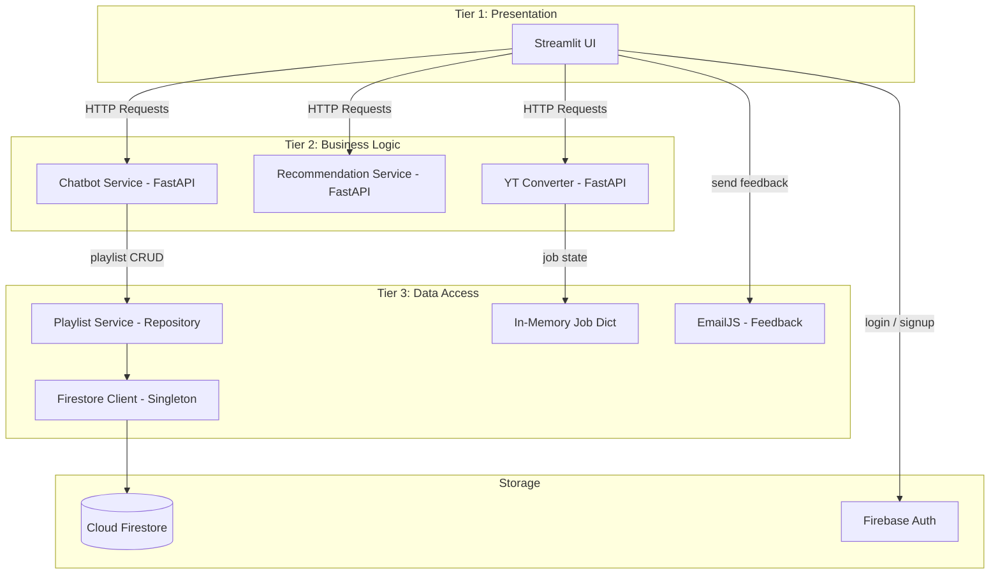

# Data Access Layer (DAL) — Theory & Concepts

## 1. What is a Data Access Layer?

The **Data Access Layer (DAL)** is a structural component in software architecture that acts as an **abstraction barrier** between the application's business logic and the underlying data storage mechanism (databases, file systems, APIs, etc.).

Instead of scattering raw database calls or API requests throughout the application, the DAL **centralizes all data operations** into a dedicated module. The rest of the application interacts with data exclusively through the DAL's clean, well-defined interface.

```
┌────────────────────────────────┐
│   Presentation Layer (UI)      │   ← Streamlit pages
├────────────────────────────────┤
│   Business Logic Layer (BLL)   │   ← FastAPI endpoints, validation, workflows
├────────────────────────────────┤
│   Data Access Layer (DAL)      │   ← THIS LAYER — abstracts all data I/O
├────────────────────────────────┤
│   Database / Storage           │   ← Firebase Firestore (Cloud NoSQL)
└────────────────────────────────┘
```

---

## 2. Why Do We Need a DAL?

### The Problem Without a DAL
Without a DAL, data access code is **scattered across the entire application**. Consider the problems:

| Problem | Description |
|---------|-------------|
| **Code Duplication** | The same Firestore collection path may appear in 5 different files |
| **Tight Coupling** | If you switch from Firestore to MongoDB or PostgreSQL, you must edit every file |
| **Security Risks** | Inconsistent security rules are harder to enforce when queries are everywhere |
| **Testing Difficulty** | You cannot test business logic without also involving the live database |
| **Maintenance Burden** | Schema/collection changes require hunting through the entire codebase |

### The Solution With a DAL
The DAL provides:
- **Single Responsibility** — All data operations live in one place
- **Loose Coupling** — Swap databases by changing only the DAL, not the entire app
- **Testability** — Mock the DAL to unit test business logic in isolation
- **Security** — Access rules and validation are enforced in one central location
- **Maintainability** — Collection/document structure changes only affect DAL code

---

## 3. DAL Design Patterns

### 3.1 Repository Pattern
The **Repository Pattern** treats domain entities as collections. Each entity type gets its own Repository class with CRUD methods:

```python
class PlaylistRepository:
    def create(self, uid: str, name: str, tracks: list) -> dict: ...
    def find_by_id(self, uid: str, playlist_id: str) -> Optional[dict]: ...
    def update(self, uid: str, playlist_id: str, data: dict) -> None: ...
    def delete(self, uid: str, playlist_id: str) -> bool: ...
```

**When to use:** When you want clean separation between domain logic and data access. Most common in enterprise applications. **SunLeo uses this pattern** — the `playlist_service.py` module wraps all Firestore interactions behind clean Python functions.

### 3.2 Active Record Pattern
Each domain object contains its own persistence methods:

```python
class Playlist:
    def save(self): ...       # SET itself to Firestore
    def delete(self): ...     # DELETE itself from Firestore

    @classmethod
    def find(cls, uid, id): ...    # GET and return instance
```

**When to use:** Simpler applications where domain objects map directly to database documents.

### 3.3 Data Mapper Pattern
A separate mapper class handles the translation between domain objects and database documents, keeping the domain objects completely unaware of the database:

```python
class PlaylistMapper:
    def to_document(self, playlist: Playlist) -> dict: ...
    def to_entity(self, doc: dict) -> Playlist: ...
```

**When to use:** Complex domains where the object model differs significantly from the database document schema.

### 3.4 Singleton Client Pattern
A shared database client is initialized once and reused across the entire application lifetime to avoid repeated authentication and connection overhead:

```python
# SunLeo's approach — firestore_client.py
_db: firestore.Client | None = None

def get_db() -> firestore.Client:
    global _db
    if _db is not None:
        return _db
    cred = credentials.Certificate(cred_path)
    firebase_admin.initialize_app(cred)
    _db = firestore.client()
    return _db
```

**When to use:** Cloud-hosted databases (Firestore, DynamoDB) where client initialization involves network authentication. SunLeo uses this to avoid re-authenticating with Firebase on every request.

---

## 4. Firebase Firestore as a Database

### 4.1 What is Firestore?
**Cloud Firestore** is a flexible, scalable **NoSQL document database** provided by Google Firebase. Unlike traditional SQL databases (SQLite, PostgreSQL), Firestore stores data as **documents inside collections**, not rows inside tables.

| SQL Concept | Firestore Equivalent | Description |
|-------------|---------------------|-------------|
| Database | Firestore Project | Top-level container for all data |
| Table | Collection | A group of related documents (e.g., `users`) |
| Row | Document | A single data record (a JSON-like map) |
| Column | Field | A key-value pair within a document |
| Primary Key | Document ID | Unique identifier for each document |
| Foreign Key | Subcollection / Reference | Nested collection or document reference |
| SQL Query | Firestore Query | `.where()`, `.order_by()`, `.limit()` |

### 4.2 Document Model
Firestore uses a hierarchical **collection → document → subcollection** model:

```
firestore-root/
├── users/                          ← Collection
│   ├── {uid_1}/                    ← Document (keyed by Firebase Auth UID)
│   │   └── playlists/              ← Subcollection
│   │       ├── {playlist_id_1}/    ← Document
│   │       │   ├── name: "Workout Mix"
│   │       │   ├── tracks: [...]
│   │       │   ├── track_count: 5
│   │       │   ├── created_at: Timestamp
│   │       │   └── updated_at: Timestamp
│   │       └── {playlist_id_2}/    ← Document
│   │           └── ...
│   └── {uid_2}/
│       └── playlists/
│           └── ...
```

### 4.3 Why Firebase Firestore for SunLeo?

| Reason | Explanation |
|--------|-------------|
| **Serverless** | No database server to configure, maintain, or scale — Google handles it |
| **Real-time sync** | Changes propagate instantly to all connected clients |
| **Integrated auth** | Firebase Auth UIDs serve as natural document keys for user-scoped data |
| **Free tier** | 1 GB storage + 50K reads/day + 20K writes/day — sufficient for SunLeo |
| **Security rules** | Firestore Rules enforce per-user data isolation at the platform level |
| **Scalability** | Automatically scales from 1 user to millions without configuration |

---

## 5. DAL vs ORM vs Raw Queries

| Aspect | Raw Firestore Calls | DAL (Custom) | ORM (e.g., SQLAlchemy) |
|--------|---------------------|--------------|------------------------|
| **Abstraction** | None — `db.collection(...).document(...).get()` everywhere | Medium — Python functions wrap Firestore calls | High — Python classes = DB tables |
| **Control** | Full control over every Firestore operation | Full control behind clean API | Limited — ORM generates SQL |
| **Complexity** | Low boilerplate, high maintenance | Medium — you write the abstraction | High boilerplate, low maintenance |
| **Database Lock-in** | Tightly coupled to Firestore | Low — can swap Firestore for another DB | SQL-specific |
| **Best For** | Tiny scripts / prototypes | Mid-size apps like SunLeo | Large SQL-based enterprise apps |

> **SunLeo uses the Custom DAL approach** — the `playlist_service.py` module and `firestore_client.py` wrap all Firestore interactions behind clean Python functions. This gives us full control while providing a clean interface for the rest of the application.

---

## 6. DAL in the Three-Tier Architecture

Building on the three-tier architecture, the DAL sits at the bottom tier:



### Data Flow Examples

**Playlist Management:**
```
User clicks "Create Playlist" in Streamlit
  → POST /playlists/{uid}  (FastAPI chatbot service)
  → playlist_service.create_playlist(uid, name, tracks)
  → get_db().collection("users").document(uid).collection("playlists").document(id).set(doc)
  → Firestore stores the document in the cloud
```

**User Authentication:**
```
User clicks "Sign In" on home page
  → Firebase Auth JS SDK opens Google OAuth popup
  → User authenticates → Firebase returns session token + UID
  → UID is stored in st.session_state.firebase_user
  → All subsequent API calls include the UID for user-scoped data
```

---

## 7. Key DAL Principles

### 7.1 Separation of Concerns
The DAL should **only** handle data operations. It should not contain business rules, validation logic, or presentation formatting.

### 7.2 User-Scoped Data Isolation
In a multi-user Firebase app, all data paths must be scoped to the authenticated user's UID to prevent unauthorized access:

```python
# ✅ CORRECT — data is scoped to the authenticated user
def _playlist_ref(uid: str, playlist_id: str):
    return get_db().collection("users").document(uid) \
                   .collection("playlists").document(playlist_id)

# ❌ WRONG — global collection, any user can access any playlist
def _playlist_ref(playlist_id: str):
    return get_db().collection("playlists").document(playlist_id)
```

### 7.3 Connection Management (Singleton Pattern)
The Firestore client should be:
- **Initialized once** (singleton) to avoid repeated authentication
- **Shared globally** — all modules use the same client instance
- **Configured lazily** — only connects when first needed

### 7.4 Error Handling
The DAL should catch Firestore-specific exceptions and raise domain-relevant errors:

```python
def get_playlist(uid: str, playlist_id: str) -> dict | None:
    doc = _playlist_ref(uid, playlist_id).get()
    if not doc.exists:
        return None            # Clean domain-level "not found"
    data = doc.to_dict()
    data["id"] = doc.id
    return data
```

### 7.5 Idempotency
DAL operations should be **safe to retry**. Firestore's `.set()` is naturally idempotent (it overwrites the document), while `.update()` only changes specified fields. This makes Firestore well-suited for reliable DAL implementations.

---

## 8. Summary

| Concept | Key Takeaway |
|---------|-------------|
| **DAL** | Abstraction layer between app logic and database |
| **Purpose** | Centralize data ops, reduce coupling, improve testability |
| **Pattern Used** | Repository Pattern (service module per entity) + Singleton Client |
| **Database** | Firebase Cloud Firestore (NoSQL, serverless, document-based) |
| **Auth** | Firebase Authentication (Google OAuth, session-based) |
| **User Isolation** | All data paths scoped to `users/{uid}/...` |
| **Security** | Firestore Security Rules + server-side UID validation |
