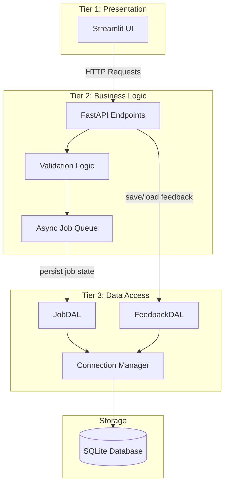

# Data Access Layer (DAL) — Theory & Concepts

## 1. What is a Data Access Layer?

The **Data Access Layer (DAL)** is a structural component in software architecture that acts as an **abstraction barrier** between the application's business logic and the underlying data storage mechanism (databases, file systems, APIs, etc.).

Instead of scattering raw SQL queries or file I/O calls throughout the application, the DAL **centralizes all data operations** into a dedicated module. The rest of the application interacts with data exclusively through the DAL's clean, well-defined interface.

```
┌────────────────────────────────┐
│   Presentation Layer (UI)      │   ← Streamlit pages
├────────────────────────────────┤
│   Business Logic Layer (BLL)   │   ← FastAPI endpoints, validation, workflows
├────────────────────────────────┤
│   Data Access Layer (DAL)      │   ← THIS LAYER — abstracts all data I/O
├────────────────────────────────┤
│   Database / Storage           │   ← SQLite, PostgreSQL, files, etc.
└────────────────────────────────┘
```

---

## 2. Why Do We Need a DAL?

### The Problem Without a DAL
Without a DAL, data access code is **scattered across the entire application**. Consider the problems:

| Problem | Description |
|---------|-------------|
| **Code Duplication** | The same SQL query may appear in 5 different files |
| **Tight Coupling** | If you switch from SQLite to PostgreSQL, you must edit every file |
| **Security Risks** | SQL injection vulnerabilities are harder to catch when queries are everywhere |
| **Testing Difficulty** | You cannot test business logic without also involving the database |
| **Maintenance Burden** | Schema changes require hunting through the entire codebase |

### The Solution With a DAL
The DAL provides:
- **Single Responsibility** — All data operations live in one place
- **Loose Coupling** — Swap databases by changing only the DAL, not the entire app
- **Testability** — Mock the DAL to unit test business logic in isolation
- **Security** — Parameterized queries are enforced in one central location
- **Maintainability** — Schema changes only affect DAL code

---

## 3. DAL Design Patterns

### 3.1 Repository Pattern
The **Repository Pattern** treats domain entities as collections. Each entity type gets its own Repository class with CRUD methods:

```python
class JobRepository:
    def create(self, job: Job) -> Job: ...
    def find_by_id(self, job_id: str) -> Optional[Job]: ...
    def update(self, job: Job) -> None: ...
    def delete(self, job_id: str) -> None: ...
```

**When to use:** When you want clean separation between domain logic and data access. Most common in enterprise applications.

### 3.2 Active Record Pattern
Each domain object contains its own persistence methods:

```python
class Job:
    def save(self): ...       # INSERT or UPDATE itself
    def delete(self): ...     # DELETE itself
    
    @classmethod
    def find(cls, id): ...    # SELECT and return instance
```

**When to use:** Simpler applications where domain objects map directly to tables.

### 3.3 Data Mapper Pattern
A separate mapper class handles the translation between domain objects and database rows, keeping the domain objects completely unaware of the database:

```python
class JobMapper:
    def to_row(self, job: Job) -> dict: ...
    def to_entity(self, row: dict) -> Job: ...
```

**When to use:** Complex domains where the object model differs significantly from the database schema.

### 3.4 Unit of Work Pattern
Tracks all changes made during a business transaction and commits them atomically:

```python
class UnitOfWork:
    def __enter__(self):
        self.connection = get_connection()
        return self
    
    def commit(self): ...
    def rollback(self): ...
```

**When to use:** When multiple related operations must succeed or fail together (transactional consistency).

---

## 4. DAL vs ORM vs Raw SQL

| Aspect | Raw SQL | DAL (Custom) | ORM (e.g., SQLAlchemy) |
|--------|---------|--------------|------------------------|
| **Abstraction** | None — SQL strings everywhere | Medium — Python methods wrap SQL | High — Python classes = DB tables |
| **Control** | Full SQL control | Full SQL control behind clean API | Limited — ORM generates SQL |
| **Complexity** | Low boilerplate, high maintenance | Medium — you write the abstraction | High boilerplate, low maintenance |
| **Performance** | Best — hand-tuned queries | Good — you control the queries | Can be suboptimal (N+1 problems) |
| **Learning Curve** | Must know SQL | Must know SQL + design patterns | Must learn ORM API |
| **Best For** | Tiny scripts | Mid-size apps like SunLeo | Large enterprise apps |

> **SunLeo uses the Custom DAL approach** — it gives us full control over SQL while providing a clean interface for the rest of the application. This is ideal for a mid-sized project and demonstrates the core DAL concepts clearly.

---

## 5. DAL in the Three-Tier Architecture

Building on the three-tier architecture from Assignment 7 (Business Logic Layer), the DAL sits at the bottom tier:



### Data Flow: Before vs After DAL

**Before (Assignment 7):**
```
FastAPI endpoint → directly writes to Python dict → data lost on restart
Feedback page   → directly writes to JSON file   → no querying capability
```

**After (Assignment 8):**
```
FastAPI endpoint → calls JobDAL.create_job()     → persisted in SQLite
FastAPI endpoint → calls JobDAL.update_status()  → durable state tracking
Feedback page   → calls FeedbackDAL.save()       → queryable, structured storage
```

---

## 6. Key DAL Principles

### 6.1 Separation of Concerns
The DAL should **only** handle data operations. It should not contain business rules, validation logic, or presentation formatting.

### 6.2 Parameterized Queries
**Never** concatenate user input into SQL strings. Always use parameterized queries to prevent SQL injection:

```python
# ❌ DANGEROUS — SQL Injection vulnerability
cursor.execute(f"SELECT * FROM jobs WHERE job_id = '{job_id}'")

# ✅ SAFE — Parameterized query
cursor.execute("SELECT * FROM jobs WHERE job_id = ?", (job_id,))
```

### 6.3 Connection Management
Database connections should be:
- **Created lazily** (only when needed)
- **Properly closed** (using context managers or `try/finally`)
- **Pooled** in production (reuse connections instead of creating new ones)

### 6.4 Error Handling
The DAL should catch database-specific exceptions and raise domain-relevant errors:

```python
try:
    await db.execute("INSERT INTO jobs ...", params)
except sqlite3.IntegrityError:
    raise DuplicateJobError(f"Job {job_id} already exists")
```

### 6.5 Idempotency
DAL operations should be **safe to retry**. If `create_job()` is called twice with the same ID, it should either succeed silently or raise a clear error — never corrupt data.

---

## 7. Summary

| Concept | Key Takeaway |
|---------|-------------|
| **DAL** | Abstraction layer between app logic and database |
| **Purpose** | Centralize data ops, reduce coupling, improve testability |
| **Pattern Used** | Repository Pattern (one class per entity) |
| **Database** | SQLite (lightweight, zero-config, file-based) |
| **Async** | `aiosqlite` for compatibility with FastAPI's async model |
| **Security** | Parameterized queries prevent SQL injection |
