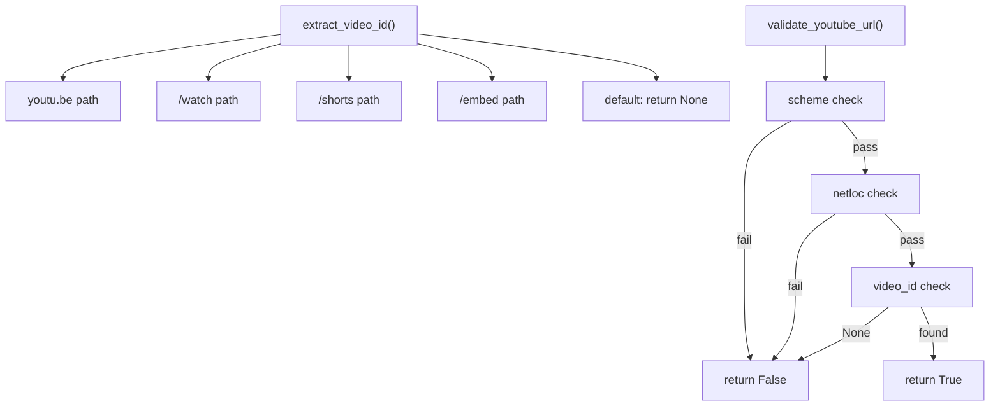
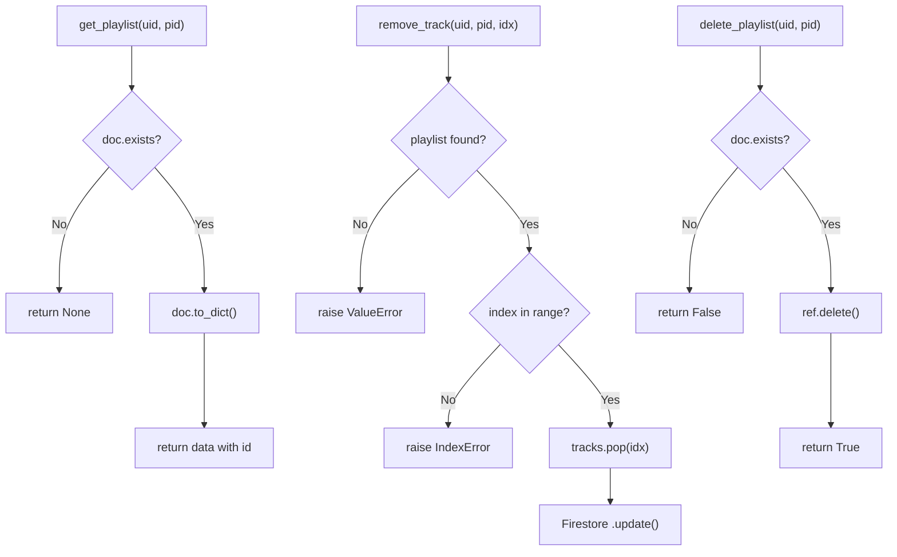

# White Box & Black Box Testing — SunLeo Implementation & Results

## Overview

This document details every test case implemented for the SunLeo application, organized by testing type. Each test includes its ID, the technique used, the target function/endpoint, and the expected outcome.

**Testing Strategy:** Since SunLeo uses **Firebase Firestore** (a cloud NoSQL database), tests use a **mocked Firestore client** that simulates collections, documents, and queries entirely in-memory. This allows tests to run **fast, offline, and without any Firebase credentials**. URL utility and job queue tests remain pure (no mocking needed).

---

## 1. White Box Test Cases

White Box tests are in [`test_whitebox.py`](file:///c:/Users/shour/Desktop/SunLeo/tests/test_whitebox.py). These tests are designed with **full knowledge of the source code**.

### Test Case Summary

| Test ID | Target Function | Technique | Description | Expected Result |
|---------|----------------|-----------|-------------|-----------------|
| WB-01a | `extract_video_id` | Path Coverage | `/watch?v=` URL format | Returns video ID `dQw4w9WgXcQ` |
| WB-01b | `extract_video_id` | Path Coverage | `youtu.be/` short URL format | Returns video ID `dQw4w9WgXcQ` |
| WB-01c | `extract_video_id` | Path Coverage | `/shorts/` URL format | Returns video ID `dQw4w9WgXcQ` |
| WB-01d | `extract_video_id` | Path Coverage | `/embed/` URL format | Returns video ID `dQw4w9WgXcQ` |
| WB-02a | `extract_video_id` | Branch Coverage | Unknown path (e.g., `/playlist`) | Returns `None` |
| WB-02b | `extract_video_id` | Branch Coverage | Empty youtu.be path | Returns `None` or `""` |
| WB-02c | `extract_video_id` | Branch Coverage | `/watch` without `?v=` param | Returns `None` |
| WB-03a | `validate_youtube_url` | Condition Coverage | All 3 conditions True | Returns `True` |
| WB-03b | `validate_youtube_url` | Condition Coverage | Invalid scheme (ftp://) | Returns `False` |
| WB-03c | `validate_youtube_url` | Condition Coverage | Invalid host (notyoutube.com) | Returns `False` |
| WB-03d | `validate_youtube_url` | Condition Coverage | No extractable video ID | Returns `False` |
| WB-04a | `create_playlist` | Statement Coverage | Create playlist, verify returned dict | Dict with `id`, `name`, `track_count` |
| WB-04b | `create_playlist` | Statement Coverage | Create playlist, verify Firestore persistence | Playlist retrievable via `get_playlist()` |
| WB-05a | `get_playlist` | Branch Coverage | Query existing playlist | Returns playlist dict |
| WB-05b | `get_playlist` | Branch Coverage | Query non-existent playlist | Returns `None` |
| WB-06a | `add_tracks` | Statement Coverage | Append tracks to existing playlist | `track_count` increases, tracks list grows |
| WB-06b | `add_tracks` | Statement Coverage | Add tracks to non-existent playlist | Raises `ValueError` |
| WB-07a | `remove_track` | Path Coverage | Remove track at valid index | Track removed, count decremented |
| WB-07b | `remove_track` | Path Coverage | Remove from non-existent playlist | Raises `ValueError` |
| WB-07c | `remove_track` | Path Coverage | Remove at out-of-range index | Raises `IndexError` |
| WB-08a | `delete_playlist` | Branch Coverage | Delete existing playlist | Returns `True`, playlist gone |
| WB-08b | `delete_playlist` | Branch Coverage | Delete non-existent playlist | Returns `False` |
| WB-09a | `get_playlists` | Statement Coverage | List all user playlists | Returns list with `id` fields |
| WB-09b | `get_playlists` | Statement Coverage | List playlists for user with none | Returns empty list |
| WB-10a | `InMemoryJobQueue` | Statement Coverage | Enqueue → worker fires | Processed IDs list contains job |
| WB-10b | `InMemoryJobQueue` | Statement Coverage | 3 concurrent workers | All 3 jobs processed |

### Code Path Mapping — URL Utilities



### Code Path Mapping — Firestore Playlist Operations



---

## 2. Black Box Test Cases

Black Box tests are in [`test_blackbox.py`](file:///c:/Users/shour/Desktop/SunLeo/tests/test_blackbox.py). These tests are designed **without looking at the source code**, based purely on the API specification and feature requirements.

### Test Case Summary

| Test ID | Target Endpoint/Feature | Technique | Input | Expected Output |
|---------|------------------------|-----------|-------|-----------------|
| BB-01 | `POST /convert` | Equivalence Partition | Valid YouTube watch URL | 200 + `{job_id, status:"queued"}` |
| BB-02a | `POST /convert` | Equivalence Partition | Non-YouTube URL (google.com) | 400 error |
| BB-02b | `POST /convert` | Equivalence Partition | Malformed string ("not-a-url") | 400 error |
| BB-03 | `POST /convert/batch` | Boundary Value (at max) | Exactly 10 valid URLs | 200 + 10 jobs |
| BB-04 | `POST /convert/batch` | Boundary Value (above max) | 11 valid URLs | 400 error |
| BB-05 | `POST /convert/batch` | Boundary Value (below min) | Empty URL list | 200 + 0 jobs |
| BB-06 | `GET /status/{job_id}` | Equivalence Partition | Existing job_id | 200 + status info |
| BB-07 | `GET /status/{job_id}` | Equivalence Partition | Non-existent job_id | 404 error |
| BB-08 | `GET /download/{job_id}` | Equivalence Partition | Queued (incomplete) job | 409 Conflict |
| BB-09a | Playlist Service | Decision Table | Create + retrieve valid playlist | Saved + retrievable by name |
| BB-09b | Playlist Service | Decision Table | Delete playlist | Removed from user's list |
| BB-09c | Playlist Service | Decision Table | Add tracks to playlist | Track count grows |
| BB-10a | Playlist Service | Boundary Value | Empty playlist (0 tracks) | Created with `track_count: 0` |
| BB-10b | Playlist Service | Boundary Value | 50 tracks | All 50 stored correctly |
| BB-10c | Playlist Service | Boundary Value | Special chars (', ", <, &, 🎵) | Data intact, no injection |
| BB-10d | Playlist Service | Boundary Value | Remove first track (index 0) | First track removed |
| BB-10e | Playlist Service | Boundary Value | Remove last track | Last track removed |
| BB-10f | Playlist Service | Boundary Value | Remove at out-of-range index | Raises IndexError |

### Equivalence Classes Used

```
┌──────────────────────────────────────────────────────┐
│ Input: YouTube URL                                   │
├─────────────────────┬────────────────────────────────┤
│ Class               │ Examples                       │
├─────────────────────┼────────────────────────────────┤
│ Valid YouTube URL    │ youtube.com/watch?v=...,       │
│                     │ youtu.be/...                   │
├─────────────────────┼────────────────────────────────┤
│ Invalid URL (wrong  │ google.com, github.com         │
│ domain)             │                                │
├─────────────────────┼────────────────────────────────┤
│ Malformed string    │ "not-a-url", "", "12345"       │
│ (not a URL)         │                                │
└─────────────────────┴────────────────────────────────┘

┌──────────────────────────────────────────────────────┐
│ Input: Playlist Track Index                          │
├─────────────────────┬────────────────────────────────┤
│ Class               │ Examples                       │
├─────────────────────┼────────────────────────────────┤
│ Valid index          │ 0, len(tracks)-1               │
├─────────────────────┼────────────────────────────────┤
│ Out of range         │ len(tracks), -1, 999           │
├─────────────────────┼────────────────────────────────┤
│ Non-existent playlist│ "fake-id"                     │
└─────────────────────┴────────────────────────────────┘
```

---

## 3. Mocking Strategy

### Why Mock Firestore?

Firestore is a **cloud-hosted database** — running tests against it would:
- Require network access and valid credentials
- Cost money (Firestore charges per read/write)
- Be slow (network round-trips)
- Risk polluting production data

### How We Mock

The [`conftest.py`](file:///c:/Users/shour/Desktop/SunLeo/tests/conftest.py) file implements a complete in-memory Firestore simulator:

| Mock Class | Simulates | Key Methods |
|------------|-----------|-------------|
| `MockFirestoreDB` | `firestore.Client` | `.collection(name)` |
| `MockFirestoreCollection` | Firestore Collection | `.document(id)`, `.order_by().stream()` |
| `MockDocumentRef` | Firestore DocumentReference | `.get()`, `.set()`, `.update()`, `.delete()` |
| `MockFirestoreDoc` | Firestore DocumentSnapshot | `.exists`, `.to_dict()`, `.id` |
| `MockQuery` | Firestore Query | `.stream()` (with sorting) |

The mock is injected using `unittest.mock.patch` so that `playlist_service.get_db()` returns the mock instead of connecting to the real Firebase:

```python
@pytest.fixture
def mock_firestore_db():
    mock_db = MockFirestoreDB()
    with patch("backend.chatbot_service.app.playlist_service.get_db", return_value=mock_db):
        yield mock_db
```

---

## 4. Test Results

> **Note:** Results are populated after running `pytest tests/ -v`

### Run Command
```powershell
cd c:\Users\shour\Desktop\SunLeo
python -m pytest tests/ -v --tb=short
```

### Results Summary

| Suite | Total Tests | Passed | Failed | Status |
|-------|-----------|--------|--------|--------|
| White Box (`test_whitebox.py`) | 24 | — | — | 🔄 Pending |
| Black Box (`test_blackbox.py`) | 17 | — | — | 🔄 Pending |
| **Total** | **41** | — | — | 🔄 Pending |

*(This table will be updated with actual results after test execution)*
