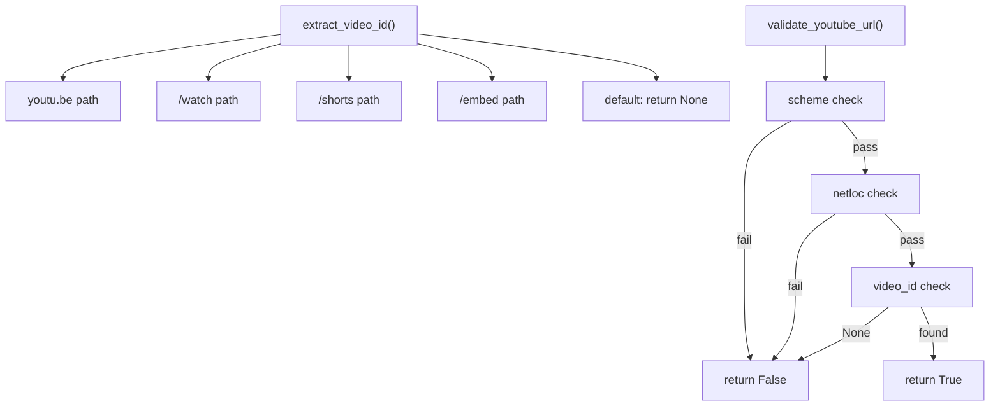

# White Box & Black Box Testing — SunLeo Implementation & Results

## Overview

This document details every test case implemented for the SunLeo application, organized by testing type. Each test includes its ID, the technique used, the target function/endpoint, and the expected outcome.

---

## 1. White Box Test Cases

White Box tests are in [`test_whitebox.py`](file:///c:/Users/shour/Desktop/SunLeo/tests/test_whitebox.py). These tests are designed with **full knowledge of the source code**.

### Test Case Summary

| Test ID | Target Function | Technique | Description | Expected Result |
|---------|----------------|-----------|-------------|-----------------|
| WB-01a | `extract_video_id` | Path Coverage | `/watch?v=` URL format | Returns video ID `dQw4w9WgXcQ` |
| WB-01b | `extract_video_id` | Path Coverage | `youtu.be/` short URL format | Returns video ID `dQw4w9WgXcQ` |
| WB-01c | `extract_video_id` | Path Coverage | `/shorts/` URL format | Returns video ID `dQw4w9WgXcQ` |
| WB-01d | `extract_video_id` | Path Coverage | `/embed/` URL format | Returns video ID `dQw4w9WgXcQ` |
| WB-02a | `extract_video_id` | Branch Coverage | Unknown path (e.g., `/playlist`) | Returns `None` |
| WB-02b | `extract_video_id` | Branch Coverage | Empty youtu.be path | Returns `None` or `""` |
| WB-02c | `extract_video_id` | Branch Coverage | `/watch` without `?v=` param | Returns `None` |
| WB-03a | `validate_youtube_url` | Condition Coverage | All 3 conditions True | Returns `True` |
| WB-03b | `validate_youtube_url` | Condition Coverage | Invalid scheme (ftp://) | Returns `False` |
| WB-03c | `validate_youtube_url` | Condition Coverage | Invalid host (notyoutube.com) | Returns `False` |
| WB-03d | `validate_youtube_url` | Condition Coverage | No extractable video ID | Returns `False` |
| WB-04a | `JobDAL.create_job` | Statement Coverage | Insert job, verify returned row | `JobRow` with status='queued' |
| WB-04b | `JobDAL.create_job` | Statement Coverage | Insert job, verify DB persistence | Row exists in DB after insert |
| WB-05a | `JobDAL.update_job_status` | Statement Coverage | Update status + started_at only | Other fields remain `None` |
| WB-05b | `JobDAL.update_job_status` | Statement Coverage | Update all fields at once | All fields reflect new values |
| WB-06a | `JobDAL.get_job` | Branch Coverage | Query existing job | Returns `JobRow` |
| WB-06b | `JobDAL.get_job` | Branch Coverage | Query non-existent job | Returns `None` |
| WB-07a | `JobDAL.delete_old_jobs` | Path Coverage | Delete old finished jobs | Returns count ≥ 1, job gone |
| WB-07b | `JobDAL.delete_old_jobs` | Path Coverage | Keep recent finished jobs | Returns 0, job still exists |
| WB-08a | `FeedbackDAL.save_feedback` | Statement Coverage | Save feedback → positive ID | Returns `int > 0` |
| WB-08b | `FeedbackDAL.save_feedback` | Statement Coverage | Save + retrieve matches | Data integrity confirmed |
| WB-09a | `FeedbackDAL.get_feedback_by_category` | Branch Coverage | Matching category | Non-empty list |
| WB-09b | `FeedbackDAL.get_feedback_by_category` | Branch Coverage | Non-matching category | Empty list |
| WB-10a | `InMemoryJobQueue` | Statement Coverage | Enqueue → worker fires | Processed IDs list contains job |
| WB-10b | `InMemoryJobQueue` | Statement Coverage | 3 concurrent workers | All 3 jobs processed |

### Code Path Mapping



---

## 2. Black Box Test Cases

Black Box tests are in [`test_blackbox.py`](file:///c:/Users/shour/Desktop/SunLeo/tests/test_blackbox.py). These tests are designed **without looking at the source code**, based purely on the API specification.

### Test Case Summary

| Test ID | Target Endpoint/Feature | Technique | Input | Expected Output |
|---------|------------------------|-----------|-------|-----------------|
| BB-01 | `POST /convert` | Equivalence Partition | Valid YouTube watch URL | 200 + `{job_id, status:"queued"}` |
| BB-02a | `POST /convert` | Equivalence Partition | Non-YouTube URL (google.com) | 400 error |
| BB-02b | `POST /convert` | Equivalence Partition | Malformed string ("not-a-url") | 400 error |
| BB-03 | `POST /convert/batch` | Boundary Value (at max) | Exactly 10 valid URLs | 200 + 10 jobs |
| BB-04 | `POST /convert/batch` | Boundary Value (above max) | 11 valid URLs | 400 error |
| BB-05 | `POST /convert/batch` | Boundary Value (below min) | Empty URL list | 200 + 0 jobs |
| BB-06 | `GET /status/{job_id}` | Equivalence Partition | Existing job_id | 200 + status info |
| BB-07 | `GET /status/{job_id}` | Equivalence Partition | Non-existent job_id | 404 error |
| BB-08 | `GET /download/{job_id}` | Equivalence Partition | Queued (incomplete) job | 409 Conflict |
| BB-09a | `FeedbackDAL` | Decision Table | All valid fields | Saved + retrievable |
| BB-09b | `FeedbackDAL` | Decision Table | Multiple categories | Filtered correctly |
| BB-10a | `FeedbackDAL` | Boundary Value | 1-char message | Saved correctly |
| BB-10b | `FeedbackDAL` | Boundary Value | 5000-char message | Full message stored |
| BB-10c | `FeedbackDAL` | Boundary Value | Special chars (', ", <, &, 🎵) | No SQL injection, data intact |

### Equivalence Classes Used

```
┌──────────────────────────────────────────────────────┐
│ Input: YouTube URL                                   │
├─────────────────────┬────────────────────────────────┤
│ Class               │ Examples                       │
├─────────────────────┼────────────────────────────────┤
│ Valid YouTube URL    │ youtube.com/watch?v=...,       │
│                     │ youtu.be/...                   │
├─────────────────────┼────────────────────────────────┤
│ Invalid URL (wrong  │ google.com, github.com         │
│ domain)             │                                │
├─────────────────────┼────────────────────────────────┤
│ Malformed string    │ "not-a-url", "", "12345"       │
│ (not a URL)         │                                │
└─────────────────────┴────────────────────────────────┘
```

---

## 3. Test Results

> **Note:** Results are populated after running `pytest tests/ -v`

### Run Command
```powershell
cd c:\Users\shour\Desktop\SunLeo
python -m pytest tests/ -v --tb=short
```

### Results Summary

| Suite | Total Tests | Passed | Failed | Status |
|-------|-----------|--------|--------|--------|
| White Box (`test_whitebox.py`) | 10+ | — | — | 🔄 Pending |
| Black Box (`test_blackbox.py`) | 10+ | — | — | 🔄 Pending |
| **Total** | **20+** | — | — | 🔄 Pending |

*(This table will be updated with actual results after test execution)*
