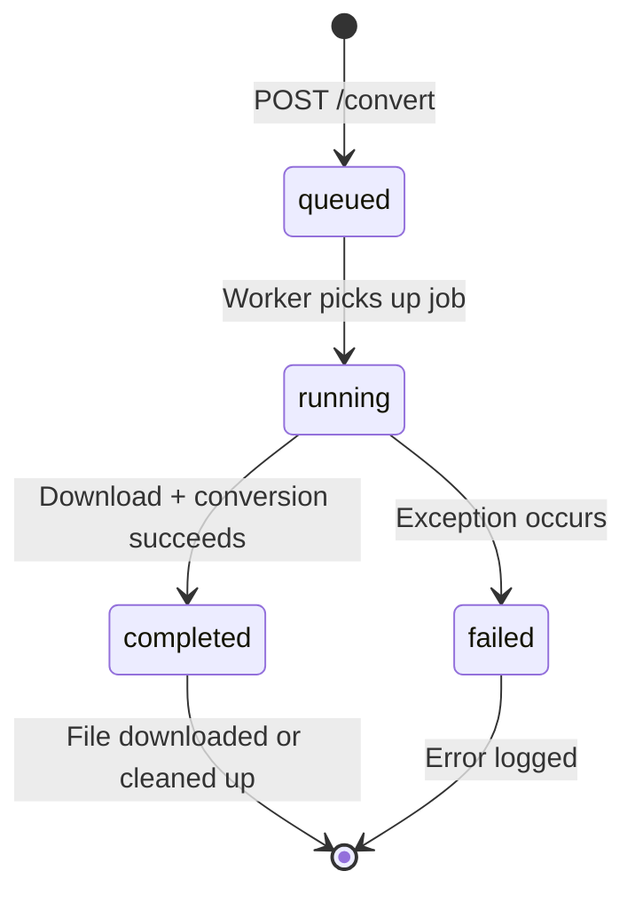
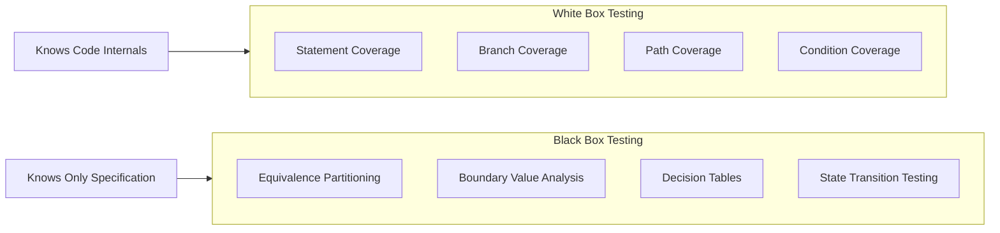

# White Box & Black Box Testing — Theory & Concepts

## 1. Introduction to Software Testing

Software testing is the process of evaluating a software application to detect differences between actual and expected behavior. Testing ensures software quality, reliability, and correctness before deployment.

There are two fundamental approaches based on the **tester's knowledge** of the internal code:

| Aspect | White Box Testing | Black Box Testing |
|--------|-------------------|-------------------|
| **Also Known As** | Glass Box, Clear Box, Structural Testing | Functional Testing, Behavioral Testing |
| **Code Knowledge** | Full access to source code | No knowledge of internals |
| **Focus** | Internal logic, paths, conditions | External behavior, inputs/outputs |
| **Who Performs** | Developers | Testers / QA Engineers |
| **Test Basis** | Source code, architecture | Requirements, specifications |
| **Goal** | Verify every code path executes correctly | Verify software meets functional requirements |

---

## 2. White Box Testing

### 2.1 Definition
White Box Testing (also called **Glass Box Testing** or **Structural Testing**) is a testing technique where the tester has **full knowledge of the internal structure, code, and logic** of the application. Tests are designed based on the code itself — examining paths, branches, conditions, and statements.

### 2.2 Key White Box Techniques

#### A) Statement Coverage
**Goal:** Ensure every line of code is executed at least once.

```python
def validate_url(url):
    parsed = urlparse(url)               # Statement 1
    if parsed.scheme not in {"http"}:     # Statement 2
        return False                      # Statement 3
    return True                           # Statement 4
```

To achieve 100% statement coverage, we need **at least 2 test cases**:
- `validate_url("http://example.com")` → executes statements 1, 2, 4
- `validate_url("ftp://example.com")` → executes statements 1, 2, 3

#### B) Branch Coverage
**Goal:** Ensure every branch (True/False) of every decision point is taken at least once.

```python
def get_status(job):
    if job is None:           # Branch 1: True/False
        return "not found"
    if job.status == "done":  # Branch 2: True/False
        return "completed"
    return "in progress"
```

We need **3 test cases** for full branch coverage:
- `job = None` → Branch 1 True
- `job.status = "done"` → Branch 1 False, Branch 2 True
- `job.status = "running"` → Branch 1 False, Branch 2 False

#### C) Path Coverage
**Goal:** Test every possible execution path through the code. This is the most thorough but also most expensive technique.

For a function with 3 independent `if` statements, there are **2³ = 8** possible paths.

#### D) Condition Coverage
**Goal:** Ensure each individual boolean sub-expression in a compound condition evaluates to both True and False.

```python
if parsed.scheme in {"http", "https"} and parsed.netloc in YT_HOSTS:
```

This compound condition has 2 sub-expressions:
- `scheme check`: must be True once and False once
- `netloc check`: must be True once and False once

### 2.3 Advantages of White Box Testing

| Advantage | Explanation |
|-----------|-------------|
| **Thorough** | Tests internal logic that may not be visible externally |
| **Finds hidden bugs** | Detects dead code, unreachable branches |
| **Optimization** | Identifies performance bottlenecks in specific code paths |
| **Early detection** | Can be performed during development (unit testing) |

### 2.4 Disadvantages

| Disadvantage | Explanation |
|--------------|-------------|
| **Expensive** | Requires deep code knowledge and time |
| **Misses requirements** | A function can work correctly internally but implement the wrong requirement |
| **Maintenance** | Tests break when code is refactored, even if behavior hasn't changed |

---

## 3. Black Box Testing

### 3.1 Definition
Black Box Testing (also called **Functional Testing** or **Behavioral Testing**) is a testing method where the tester evaluates the software **without knowing its internal code or structure**. Tests are designed based on specifications, requirements, and expected input/output behavior.

### 3.2 Key Black Box Techniques

#### A) Equivalence Partitioning
Divide input data into **equivalence classes** where all values in a class should produce the same behavior. Test one representative value from each class.

**Example — YouTube URL validation:**
| Class | Example | Expected |
|-------|---------|----------|
| Valid YouTube watch URL | `https://youtube.com/watch?v=abc` | Valid |
| Valid shortened URL | `https://youtu.be/abc` | Valid |
| Non-YouTube URL | `https://google.com` | Invalid |
| No scheme | `youtube.com/watch?v=abc` | Invalid |

#### B) Boundary Value Analysis (BVA)
Test at the **boundaries** of input ranges, where bugs most commonly occur. Test the minimum, maximum, and values just inside/outside the boundary.

**Example — Batch URL limit (max 10):**
| Input | Value | Expected |
|-------|-------|----------|
| Below boundary | 9 URLs | ✅ Accepted |
| At boundary | 10 URLs | ✅ Accepted |
| Above boundary | 11 URLs | ❌ Rejected (400 error) |
| Minimum | 0 URLs | ❌ Rejected (empty) |
| Just above min | 1 URL | ✅ Accepted |

#### C) Decision Table Testing
Create a table mapping all **combinations of conditions** to expected **actions/outcomes**.

**Example — Feedback form submission:**
| Name Valid | Email Valid | Message Valid | Outcome |
|-----------|-------------|---------------|---------|
| ✅ | ✅ | ✅ | Saved successfully |
| ❌ | ✅ | ✅ | Error: Name required |
| ✅ | ❌ | ✅ | Error: Valid email required |
| ✅ | ✅ | ❌ | Error: Message required |

#### D) State Transition Testing
Test how the system transitions between different **states** based on inputs.

**Example — Job Status Transitions:**


### 3.3 Advantages of Black Box Testing

| Advantage | Explanation |
|-----------|-------------|
| **User perspective** | Tests what matters — does it work for the end user? |
| **No code bias** | Tester isn't influenced by implementation details |
| **Specification-based** | Catches requirements gaps |
| **Independent** | Can be performed by non-developers |

### 3.4 Disadvantages

| Disadvantage | Explanation |
|--------------|-------------|
| **Limited coverage** | Cannot guarantee all code paths are tested |
| **Redundant tests** | May test the same internal path multiple times |
| **Cannot find** | Dead code, unused variables, or internal logic errors |

---

## 4. When to Use Which?

| Scenario | Recommended | Reason |
|----------|-------------|--------|
| Unit testing utility functions | White Box | Need to cover all branches/paths |
| API endpoint testing | Black Box | Focus on correct HTTP responses |
| Database operations | White Box | Verify SQL executes correctly |
| User form validation | Black Box | Test from user's perspective |
| Security testing | White Box | Need to trace data flow for injection vulnerabilities |
| Acceptance testing | Black Box | Validate against user requirements |
| Integration testing | Both | White box for data flow, black box for behavior |

---

## 5. Summary



Both techniques are **complementary**, not competing. A thorough testing strategy uses White Box testing to verify internal correctness and Black Box testing to validate external behavior. Together, they provide **comprehensive quality assurance**.
