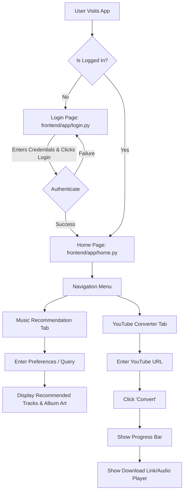
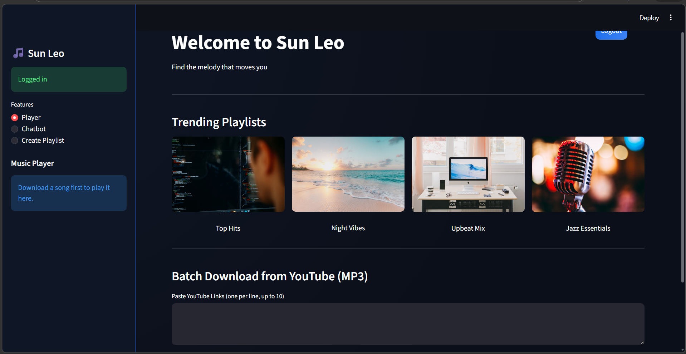
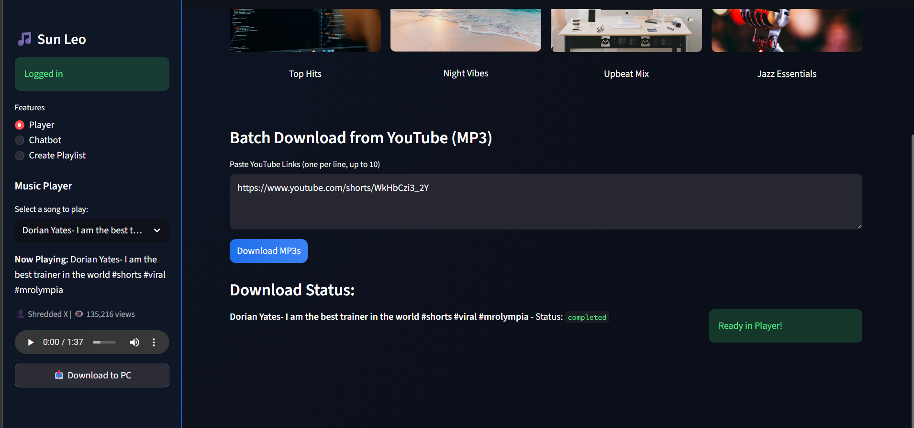
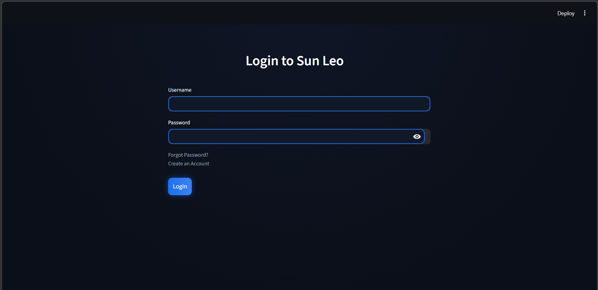

# CS 331 (Software Engineering Lab) - Assignment 6: User Interface Design

## I. Choice of UI and Justification

**Chosen UI Type:** A Web-based Graphical User Interface (GUI) utilizing a hybrid of **Menu-based Interface**, **Direct Manipulation**, and **Conversational / Form-based input**.

### Justification:

The SunLeo project comprises complex backend microservices including a Recommendation Service and a YouTube Converter Service. To make this accessible to the end-user, a Web GUI was chosen (implemented via Streamlit).

1. **Intuitive Interaction (Direct Manipulation & Forms):** Users want to simply search for a song, enter a prompt for recommendations, or click a button to download/convert audio. A GUI allows users to directly interact with visual elements (buttons, input fields, track cards) rather than remembering complex command-line arguments.
2. **Clear Navigation (Menu-based):** A sidebar or top navigation menu allows seamless switching between features (e.g., Home, Login, Settings, Converter, Recommendations).
3. **Accessibility:** A web-based GUI requires no local installation of the complex Python backend on the user's machine, making the platform platform-independent and highly accessible.
4. **Visual Feedback:** Processes like downloading and converting media or fetching machine learning recommendations take time. A GUI provides loading spinners, progress bars, and visual error/success messages which are crucial for a good user experience.

---

## II. UI Code Components and User Interactions

### Implementation Details

The UI is implemented using **Streamlit** (in Python). The code is modularized within the `frontend/` directory:

- `frontend/app/login.py`: Handles user authentication, presenting form inputs for username and password.
- `frontend/app/home.py`: The main dashboard where users interact with the core features (Music Recommendations and YouTube Conversion).

### User Interaction Flow (Diagram)

_Note for submission: You should also add actual screenshots of your running Streamlit application below the diagram to show the real visual implementation._

### Application Screenshots

**1. Home Screen:**

**2. Download / Converter Screen:**

**3. Login Screen:**

